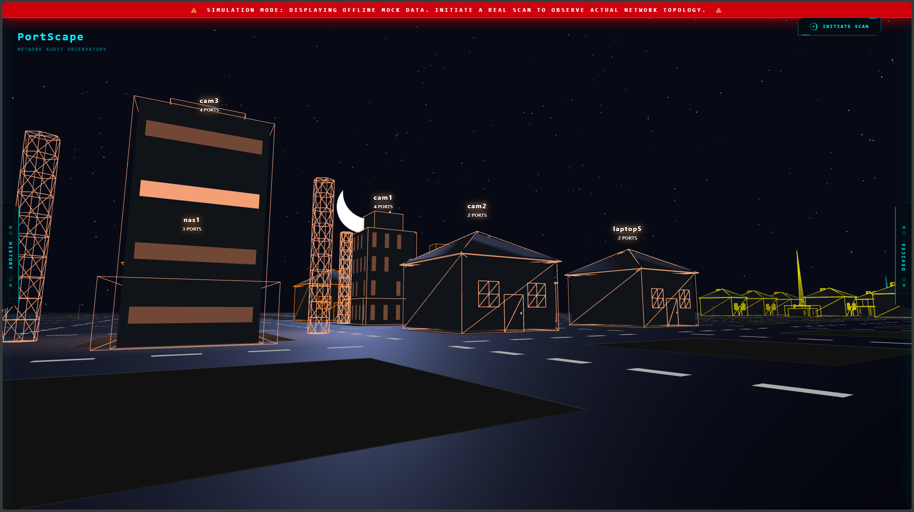
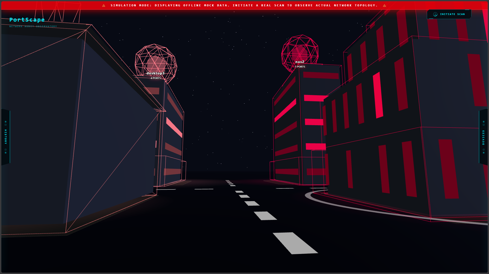
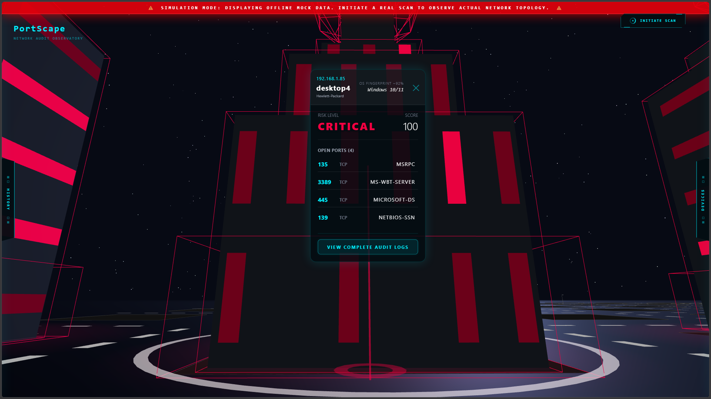
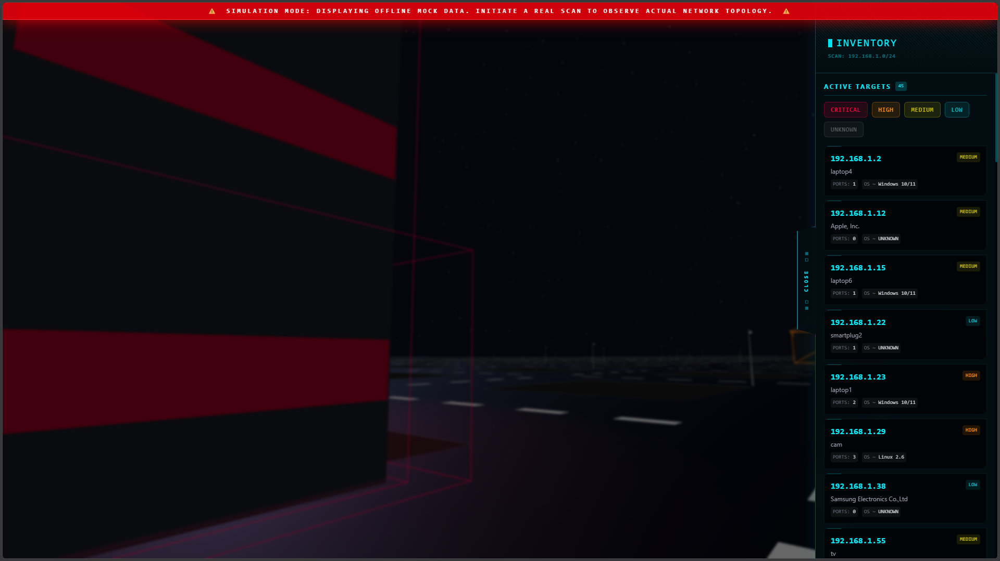
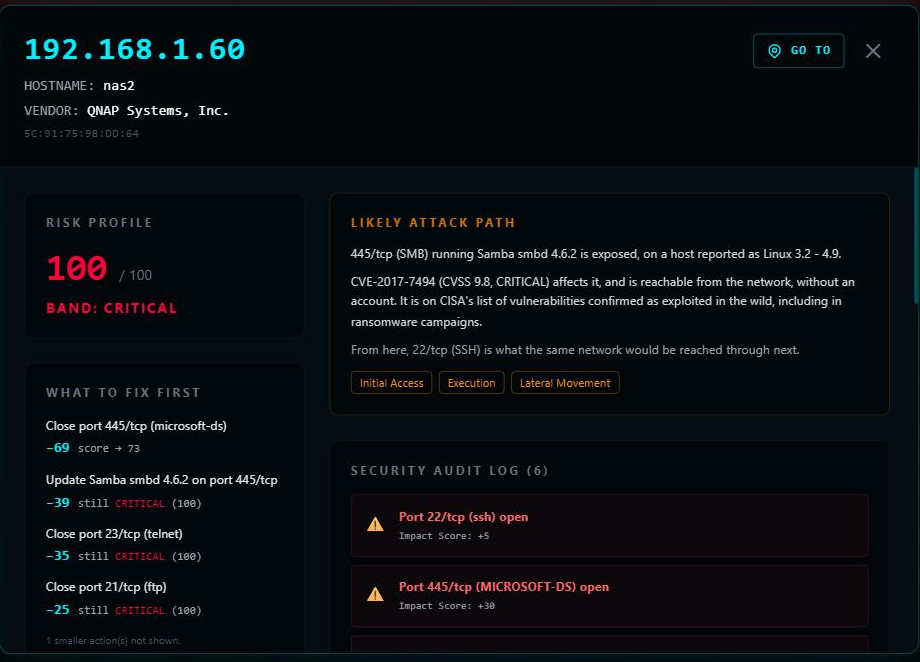

<div align="center">

# Portscape

**Turn an nmap scan into a 3D city you can walk through.**

Every device on your network becomes a building. Height is the number of open ports,
colour is the risk band, and anything that wasn't there last time is marked on the ground.

[](https://github.com/brunovieira88/PortScape/actions/workflows/ci.yml)
[](LICENSE)
[](https://openjdk.org/projects/jdk/21/)
[](https://spring.io/projects/spring-boot)
[](https://react.dev)
[](https://threejs.org)



</div>

---

> [!IMPORTANT]
> **Responsible use.** Portscape only scans private networks — `10.0.0.0/8`,
> `172.16.0.0/12`, `192.168.0.0/16` and loopback. Any other target is rejected with
> HTTP 400. The restriction lives in the code (`TargetValidator`), not just in this
> README. Only scan networks you own or have explicit permission to test.

## Contents

- [Why this exists](#why-this-exists)
- [Highlights](#highlights)
- [Quick start](#quick-start)
- [How it works](#how-it-works)
- [The risk model](#the-risk-model)
- [Baseline and change detection](#baseline-and-change-detection)
- [The inventory panel](#the-inventory-panel)
- [API](#api)
- [A note on OS detection](#a-note-on-os-detection)
- [Configuration](#configuration)
- [Tests](#tests)
- [Project structure](#project-structure)
- [Stack](#stack)
- [Author](#author)

## Why this exists

nmap tells you *what is open*. Portscape tells you *what that means*, and then makes it
something you can look at.

Most network tools hand you a table. A table of forty hosts is a table; a street of
forty buildings is a place — you notice the one that's taller than everything around it,
and you notice the one that wasn't there yesterday. The interesting engineering isn't
running nmap, it's the two layers on top:

- **A risk model with an opinion.** A device isn't dangerous because it has many ports
  open. It's dangerous because it has the *wrong* ports open. Telnet on 23 costs 35
  points; HTTPS on 443 costs 2. Every point carries a reason string, so the UI can
  answer "why 78?" instead of just showing the number.
- **Identity that survives DHCP.** Devices are tracked by MAC address, not by IP. A
  phone that moves from `.68` to `.70` overnight is the same phone — comparing by
  address turned every lease renewal into "a host vanished and a new one appeared",
  which is exactly the alarm this project exists to make trustworthy.

<p align="center">
  
  <br>
  <sub>A CRITICAL district. The colour is the risk band; the height is the port count. You don't read this street — you notice it.</sub>
</p>

## Highlights

|   | |
|---|---|
| **Real CVEs, not guesses** | Cross-references detected service versions against the NVD, resolving the canonical CPE first — because nmap and NIST rarely agree on a product's name. |
| **Baseline diffing** | Every scan is compared against a 7-day inventory, or against a snapshot you pin yourself. New and changed devices are marked in the city. |
| **Honest degradation** | If the NVD is unreachable the scan still completes, flagged `cveLookupDegraded`. "No CVEs found" and "couldn't check" are never shown as the same thing. |
| **Deterministic architecture** | A building's shape is derived from its IP and its MAC vendor, so the same device looks the same in every scan. A gateway is always a spire. |
| **306 tests** | 219 unit + 37 integration on the backend (Testcontainers, real PostgreSQL), 50 on the frontend. Every scoring rule, parser and layout calculation is covered. |

## Quick start

**Requirements:** Java 21 · Maven 3.9+ · Node 22+ · nmap 7.9+ · Docker (for PostgreSQL)

```bash
git clone https://github.com/brunovieira88/PortScape.git
cd PortScape

docker compose up -d                    # PostgreSQL only — see note below
cd backend  && mvn spring-boot:run      # http://localhost:8080
cd frontend && npm install && npm run dev   # http://localhost:5173
```

Then open http://localhost:5173, leave the target blank, and hit **Initiate Scan**.

> **The database runs in Docker; nmap does not.** On Docker Desktop for macOS,
> `--network host` is the LinuxKit VM rather than macOS itself — the scan reports hosts
> that don't exist on the real network. A silent wrong answer is worse than an error,
> so nmap runs natively on the host.

### Privileged scanning

The default configuration uses `-sS` (SYN scan) and `-O` (OS detection), which need
root. Without privileges the scan fails with `NMAP_PRIVILEGE` and a message explaining
the options.

```bash
sudo visudo -f /etc/sudoers.d/portscape-nmap
# <user> ALL=(root) NOPASSWD: /opt/homebrew/Cellar/nmap/*/bin/nmap
```

```yaml
portscape:
  nmap:
    command: ["sudo", "-n", "/opt/homebrew/bin/nmap"]
```

Setting the setuid bit on nmap is *not* recommended: a setuid-root nmap lets anyone run
NSE scripts as root, and `brew upgrade` resets the permissions anyway.

## How it works

```mermaid
flowchart LR
    A[POST /api/scans] --> B[TargetValidator]
    B --> C[Phase 1: discovery<br/>privileged, -sS -O]
    C --> D[Phase 2: versions<br/>unprivileged, -sT -sV]
    D --> E[ScanResultMerger]
    E --> F[RiskScorer<br/>+ NVD CVE lookup]
    F --> G[BaselineResolver<br/>7-day inventory]
    G --> H[CityLayoutCalculator<br/>districts by risk band]
    H --> I[(PostgreSQL)]
    I --> J[React Three Fiber<br/>the city]
```



Scans are asynchronous — a `/24` takes minutes. `POST` returns `202` immediately and the
client polls `GET /api/scans/{id}`, which reports real progress parsed from nmap's own
task output.

### Why two nmap invocations

On macOS, running `-sV` as root makes nmap fail to bind its version probes
(`NSOCK ERROR mksock_bind_addr ... Invalid argument`) and *every* port comes back as
`tcpwrapped` — even an obvious SSH or HTTP. It doesn't depend on `-sS` vs `-sT`, or on
`-O`. It happens whenever `-sV` runs as root on this platform.

So the scan runs twice:

1. **Discovery** — privileged, configurable, no `-sV`. Finds hosts, ports and OS.
2. **Version detection** — unprivileged, fixed as `-sT -sV`, only against the hosts and
   ports phase 1 found open.

`ScanResultMerger` joins them field by field: ports and OS always come from phase 1;
service, product and version come from phase 2 when available. If phase 2 fails
entirely the scan still finishes `DONE`, just without versions — a weaker second pass
is not a reason to throw away the first.

## The risk model

Scores run 0–100 and saturate at the top. Every point has a reason attached.

<p align="center">
  
  <br>
  <sub>Walk up to a building and its score explains itself, right there in the city — no separate dashboard to alt-tab to.</sub>
</p>

| Rule | What it scores |
|---|---|
| `OPEN_PORT` | Each open port, weighted by port number. Telnet (23) and SMB (445) cost a lot; HTTPS (443) costs almost nothing. Ports without a weight of their own are capped in total, so a NAS with ten mundane ports can't reach CRITICAL by volume alone. |
| `KNOWN_CVE` | Real CVEs from the NVD for the detected version, weighted by the worst CVSS. One critical flaw outweighs several minor ones. |
| `UNKNOWN_HOST` | The device wasn't in the baseline. Costs risk purely for existing, regardless of its ports. |
| `NEW_PORT` | Ports a known host didn't have open before. |

All weights live in `application.yml` under `portscape.risk`. They are an editorial
judgement, not a constant of the universe — and they're meant to be argued with.

<details>
<summary><b>How CVE lookup actually works</b></summary>

<br>

The CPEs nmap emits almost never match the NIST dictionary. nmap says
`matt_johnston:dropbear_ssh_server`; the NVD knows
`dropbear_ssh_project:dropbear_ssh`. For nginx, nmap says `igor_sysoev` and NIST says
`f5`. So the client makes two requests: it resolves the canonical name via `/cpes/2.0`
first, then asks for CVEs via `/cves/2.0`.

A CPE **without a version** is deliberately ignored. It would match every CVE ever
published for that product, and attributing those to the host would be inventing risk.

Responses are cached in PostgreSQL. Without the cache, the NVD rate limit (5 requests
per 30s without a key) dominated the scan duration. Set `PORTSCAPE_NVD_API_KEY` to
raise it to 50.

The `empty-cache-ttl` is deliberately shorter than `cache-ttl`: "no CVEs" comes both
from a genuinely clean product and from a name the NVD didn't recognise, and caching
the second case for a week would hide the problem for a week.

**Privacy:** only software CPE identifiers are sent to the NVD (e.g.
`cpe:2.3:a:openbsd:openssh:9.6`) — never IP addresses, hostnames or scan results. Turn
it off entirely with `portscape.nvd.enabled: false`.

</details>

## Baseline and change detection

Each scan is compared against a reference, resolved in this order:

1. The scan **pinned** for that network, if one exists (`POST /api/baselines`).
2. Otherwise, a **7-day inventory** — every device seen on that network in the last week,
   merged by identity, most recent record winning.
3. Otherwise, nothing. On the first scan of a network there is no term of comparison,
   and marking every host as new would be noise rather than signal. Hosts come back
   `UNKNOWN`, which is not the same as `UNCHANGED`.

A host is `CHANGED` if its open ports or its OS fingerprint changed. Service version
does *not* count: nmap gets it intermittently, and treating that as a change would fill
the city with false alarms.

> **Scores are stored; diffs are computed on read.** A score depends on the CVEs the NVD
> knew about at scan time — recomputing it weeks later would give a different number and
> the history would stop being comparable. A diff depends on the *current* baseline, and
> storing it would leave the flags lying the moment someone pins a different one.

## The inventory panel

The city is for noticing; the side panel is for finding. Every host, sorted by IP
address (not alphabetically — `192.168.1.2` sorts before `192.168.1.100`), filterable
by risk band. Click one and a **Go To** button drops you next to that exact building in
the 3D city, facing it.

<p align="center">
  
</p>

## API

| Method | Route | Response |
|---|---|---|
| `POST` | `/api/scans` | `202` + `Location`. Body `{"target":"192.168.1.0/24"}` is optional — without it, the local network is detected automatically. |
| `GET` | `/api/scans/{id}` | Scan state, and when `DONE`, hosts with risk scores and change flags. |
| `GET` | `/api/scans/{id}/diff` | Full comparison against the baseline, including hosts that disappeared. |
| `GET` | `/api/scans` | Scan history (summaries). |
| `DELETE` | `/api/scans/{id}` | Deletes a scan. |
| `GET` | `/api/baselines` | Pinned baselines. |
| `POST` | `/api/baselines` | Pins a scan as reference. Body `{"scanId":"..."}` — the network comes from the scan itself. |
| `DELETE` | `/api/baselines?target=192.168.1.0/24` | Reverts to the implicit baseline. |

The target goes in the query string rather than the path because it contains a slash
(`192.168.1.0/24`), and an encoded slash in a path variable is rejected by Tomcat by
default.

```bash
curl -XPOST localhost:8080/api/scans \
  -H 'Content-Type: application/json' -d '{"target":"192.168.1.0/24"}'

curl localhost:8080/api/scans/<id> | jq
```

<p align="center">
  
  <br>
  <sub>The same data the JSON below carries, laid out for a person instead of a parser.</sub>
</p>

<details>
<summary><b>Example response</b></summary>

<br>

```json
{
  "id": "e910311a-…", "target": "192.168.1.0/24", "status": "DONE",
  "startedAt": "2026-08-28T15:39:31Z", "finishedAt": "2026-08-28T15:41:43Z",
  "durationMs": 132000, "hostsUp": 1, "progress": 100,
  "baselineScanId": "dd1a1521-…", "cveLookupDegraded": false,
  "hosts": [
    { "ip": "192.168.1.254", "mac": "68:AA:C4:F8:93:9F", "vendor": "Altice Labs",
      "hostname": "router.lan",
      "osGuess": "Linux 5.4 - 5.15", "osAccuracy": 94, "portCount": 2,
      "riskScore": 100, "riskBand": "CRITICAL",
      "position": { "x": 0, "z": 0 },
      "riskReasons": [
        {"code": "OPEN_PORT", "description": "Port 23/tcp open (telnet)", "points": 35},
        {"code": "KNOWN_CVE",
         "description": "CVE-2020-36254 (CVSS 8.1) in Dropbear sshd 2017.75 on port 22 -- and 4 more known CVE(s)",
         "points": 35}
      ],
      "change": "UNCHANGED", "isNew": false, "isChanged": false,
      "ports": [
        {"number": 22, "protocol": "tcp", "state": "open",
         "service": "ssh", "product": "Dropbear sshd", "version": "2017.75",
         "cpes": ["cpe:/a:matt_johnston:dropbear_ssh_server:2017.75"]},
        {"number": 23, "protocol": "tcp", "state": "open",
         "service": "telnet", "product": "BusyBox telnetd", "version": null, "cpes": []}
      ] }
  ]
}
```

When a scan fails, the status is `FAILED` and the response carries
`error: {code, message}` — for example `NMAP_PRIVILEGE`, `NMAP_NOT_FOUND` or
`NMAP_XML_PARSE_FAILED`. Client errors follow RFC 7807 with a Portscape-specific `code`.

</details>

## A note on OS detection

nmap doesn't read a device's operating system. It compares the signature of its TCP
stack against a database and returns the closest neighbour it knows. A device that
isn't in that database comes back as something else entirely — with high confidence.

Two scans of the same Xiaomi TV, four hours apart, produced *Nintendo Switch (97%)* and
*Android 10–12 (97%)*. The percentage is nmap's confidence in the resemblance, not in
the answer. So the UI labels it `OS Fingerprint` rather than "OS detected", and where
the fingerprint disagrees with the MAC vendor, the vendor wins — that one is derived
from an IEEE-registered prefix and is verifiable.

## Configuration

Everything lives in `backend/src/main/resources/application.yml`:

| Prefix | Controls |
|---|---|
| `portscape.nmap` | `command`, `default-target`, `arguments`, `timeout`, `host-timeout` |
| `portscape.nvd` | `enabled`, `base-url`, `api-key`, `timeout`, `min-request-interval`, `cache-ttl`, `empty-cache-ttl` |
| `portscape.risk` | `port-weights` and the weight of every scoring rule |
| `portscape.baseline` | `window` — how far back the inventory reaches (default 7 days) |
| `portscape.layout` | `spacing`, `grid-width`, `district-gap` for the 3D layout |

The database is configured by environment variables — `POSTGRES_URL`, `POSTGRES_USER`,
`POSTGRES_PASSWORD` — with development defaults.

If `POST /api/scans` doesn't name a target, the app asks the OS which interface holds
the default route and derives the subnet from it, without sending a single packet. This
avoids picking the wrong interface on a machine with several active (Wi-Fi + Ethernet,
VPN), and keeps the target correct when you move between networks.

## Tests

```bash
cd backend
mvn test        # 219 unit tests, seconds, no Docker needed
mvn verify      # + 37 integration tests (Testcontainers, needs Docker)

cd frontend
npm test        # 50 tests
npx tsc -b      # type check
```

The schema is owned by Flyway (`backend/src/main/resources/db/migration`) and Hibernate
runs with `ddl-auto: validate`, so entities and migrations can't drift apart unnoticed.

CI runs both suites on every push and pull request. It exists because of a specific
incident: a sort-order inversion in baseline resolution shipped inside an unrelated
commit, two integration tests caught it the same day, and nobody noticed — the suite was
already red for other reasons, and a suite that already fails stops being a signal.

## Project structure

```
portscape/
├── backend/src/main/java/com/portscape/
│   ├── api/            REST controllers — thin, logic lives below
│   ├── scan/           nmap execution and XML parsing
│   ├── risk/           risk scoring
│   ├── baseline/       baseline resolution and diffing
│   ├── layout/         3D city layout calculation
│   ├── domain/         JPA entities (Host, Port, Scan, Baseline)
│   ├── persistence/    repositories
│   └── config/         typed @ConfigurationProperties
├── frontend/src/
│   ├── scene/          Three.js components (City, Building, StreetControls)
│   │   ├── buildings/  per-archetype geometry — house, tower, windows
│   │   └── highlights/ new/changed host markers
│   ├── ui/             side panels, modals, scan history
│   ├── api/            REST client
│   └── mock/           offline demo data (no backend needed)
└── CLAUDE.md           project conventions for AI-assisted development
```

## Stack

- **Backend** — Java 21, Spring Boot 3.5, PostgreSQL, Flyway, JUnit 5, Testcontainers
- **Frontend** — React 19, TypeScript, Vite, Three.js via React Three Fiber, Tailwind CSS
- **Scanning** — nmap, parsed from its XML output

Deliberately a simple monolith. No message queues, no microservices, no WebSockets — the
complexity belongs in the visualisation and the scoring, not in the infrastructure.

## Author

**Bruno Vieira** — [GitHub](https://github.com/brunovieira88) ·
[LinkedIn](https://www.linkedin.com/in/bruno-vieiraaa/)

## License

[MIT](LICENSE) © Bruno Vieira
